# Projeto de Interface

O projeto de interface está divido em 10 páginas, são elas: landing page, página de login, cadastro, dashboard, extrato, despesas, metas, simulação, todos os artigos e artigo único. Há um menu lateral presente em todas as páginas que possibilita o usuário facilmente acessar o conteúdo desejado.

## Site map

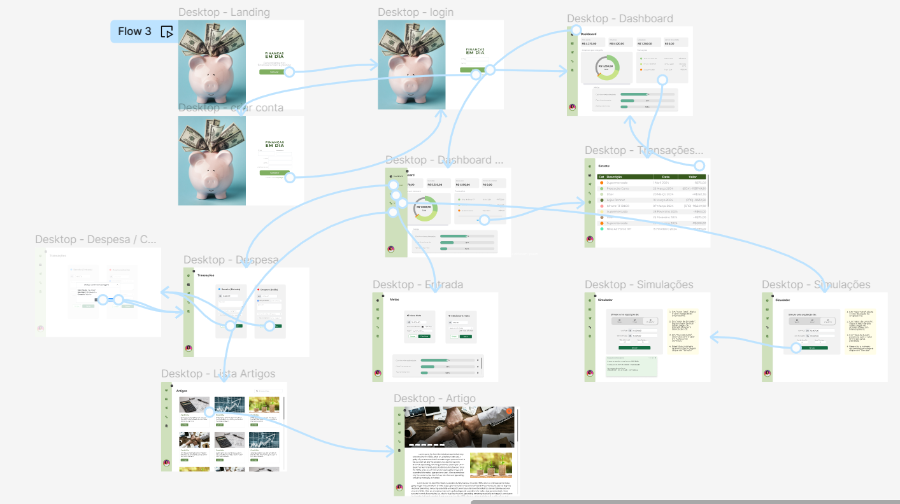

## Wireframes

### Landing Page

### Login

### Criar conta

### Dashboard

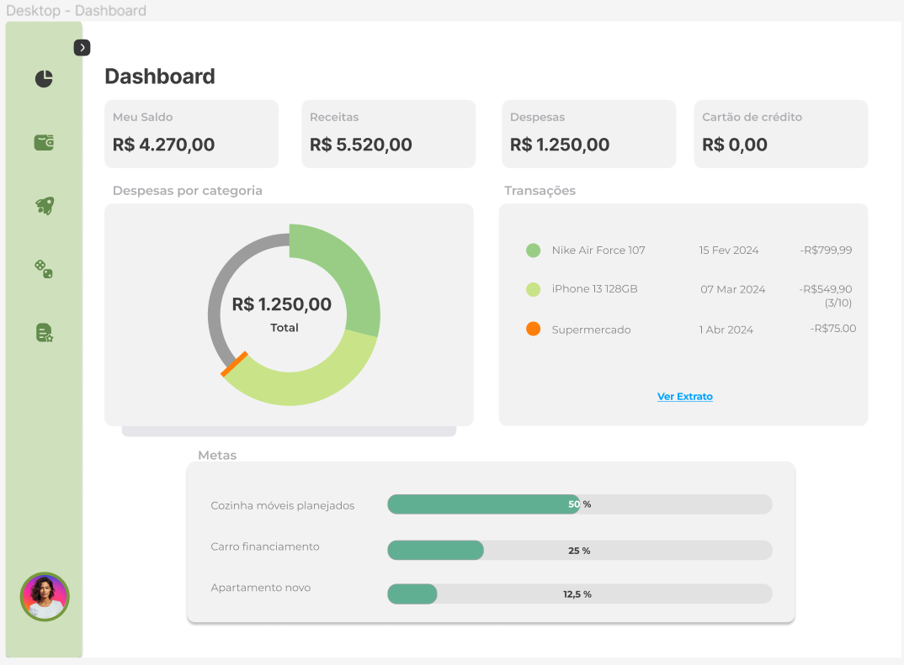

### Dashboard menu

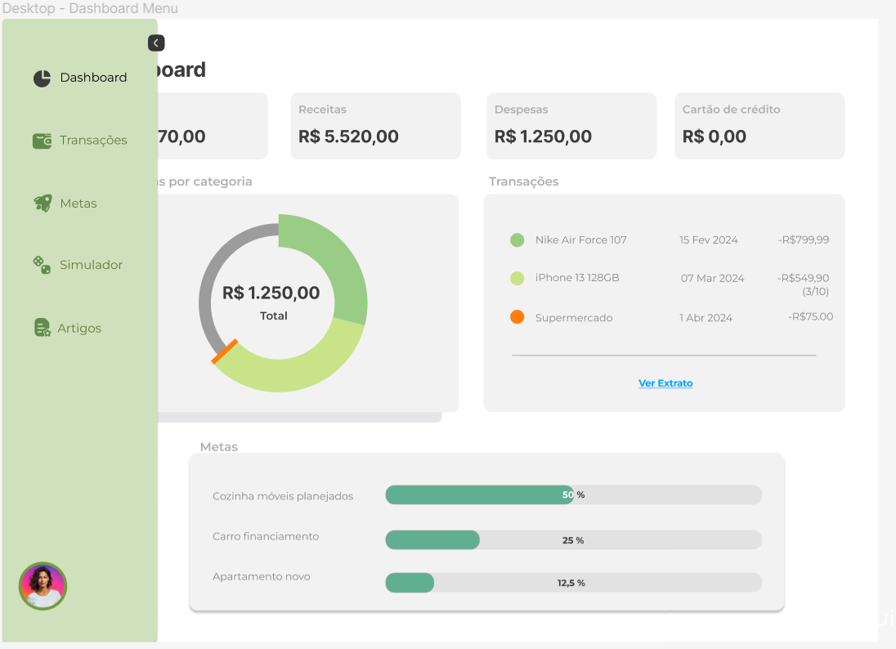

### Extrato

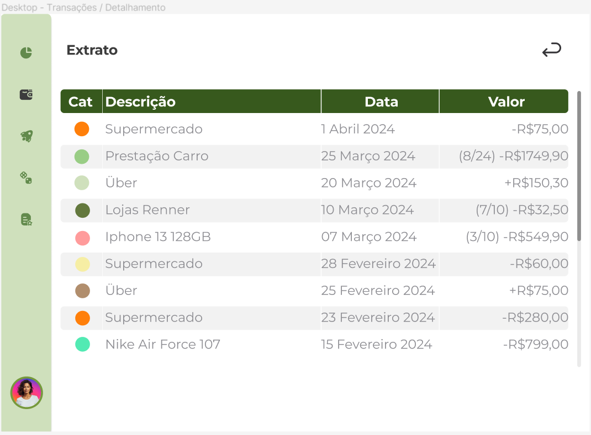

### Despesas

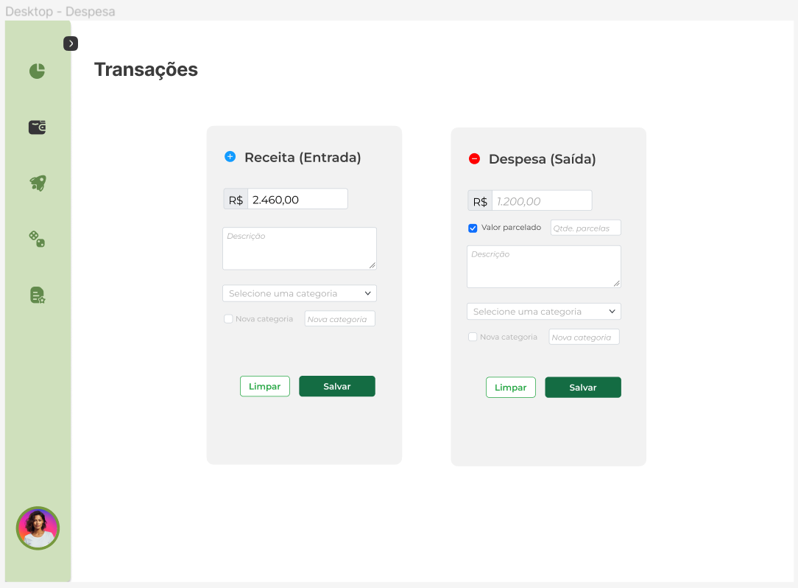

### Despesa Confirmação

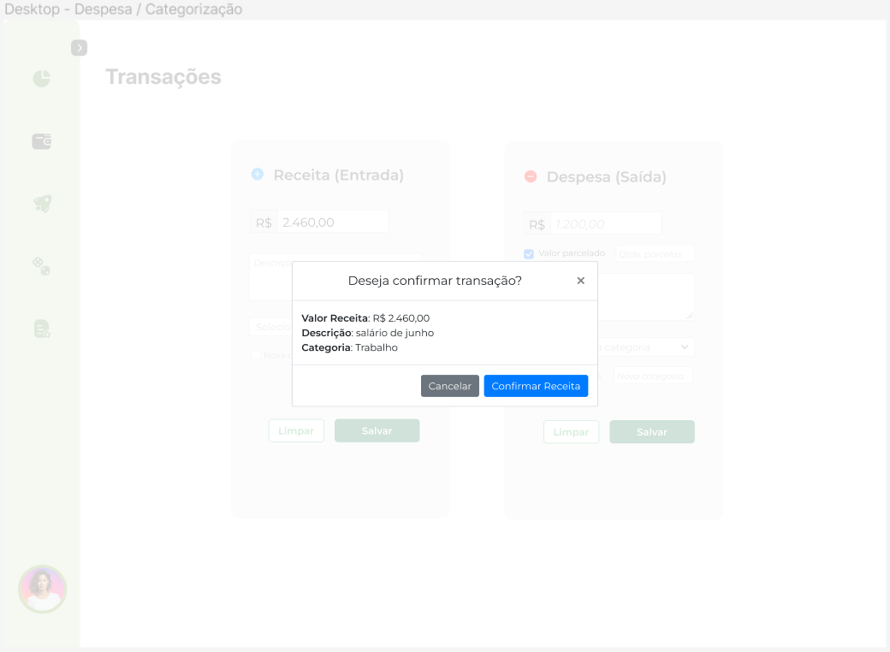

### Metas

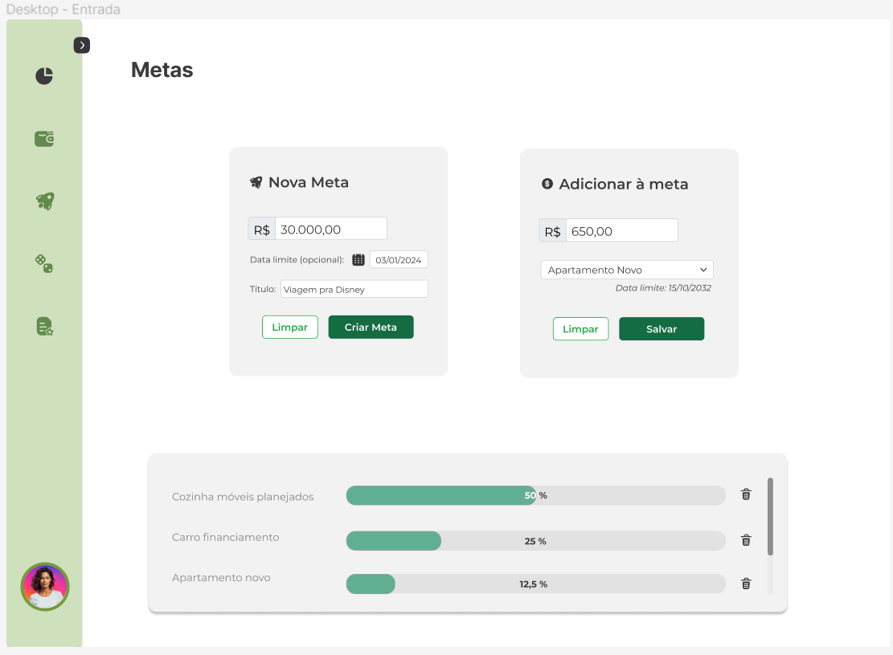

### Simulação

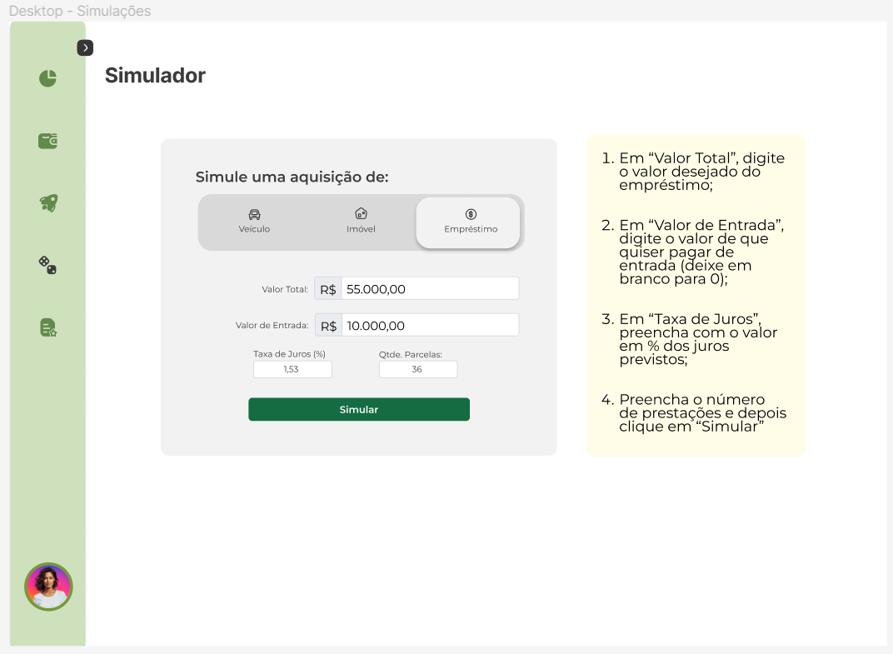

### Simulação resultado

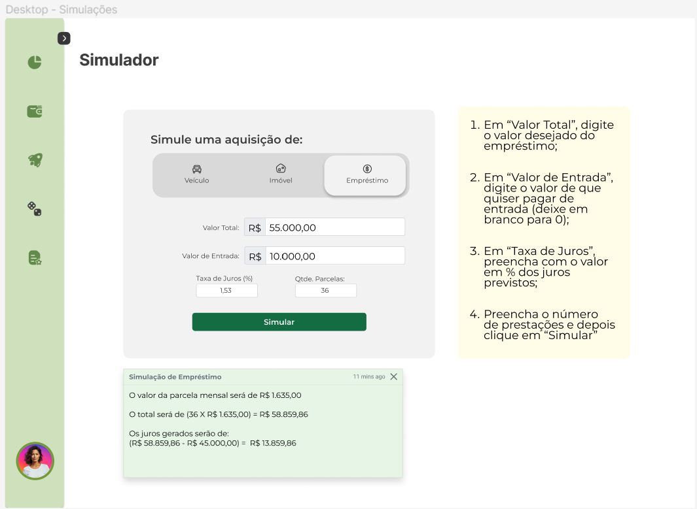

### Artigos

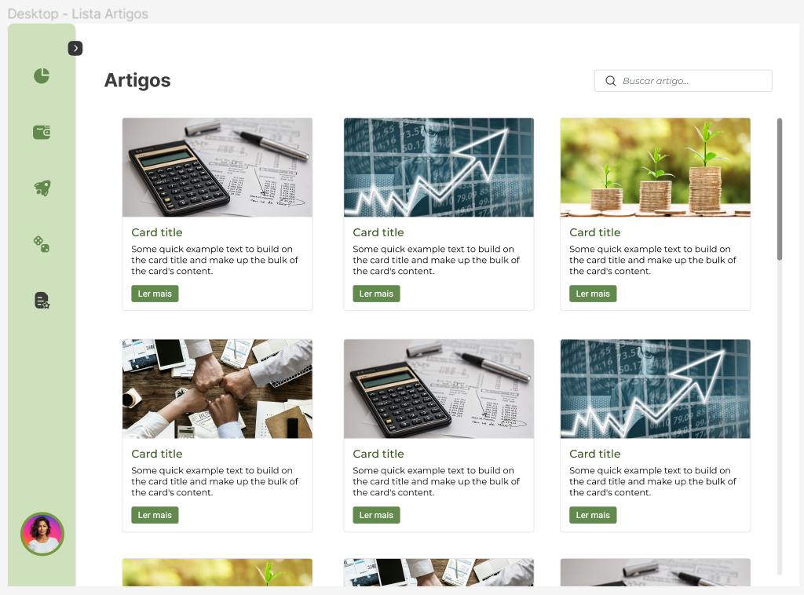

### Artigo

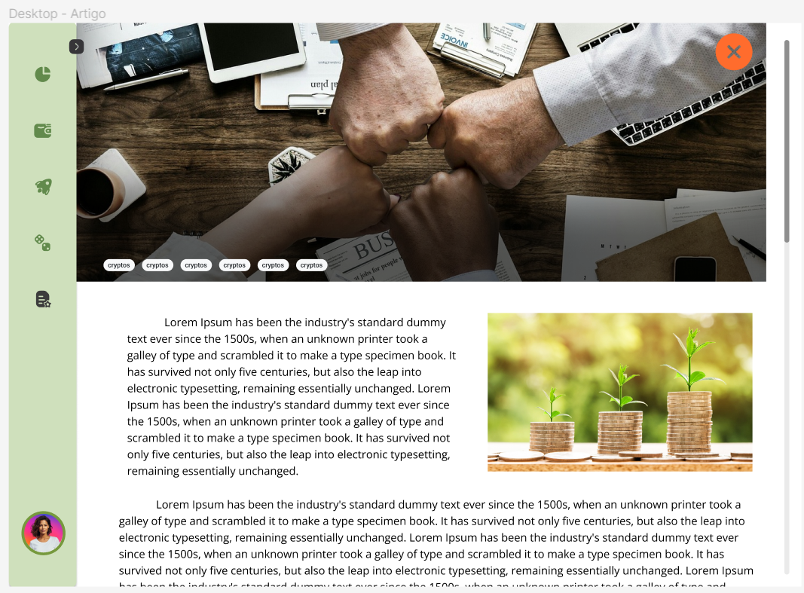
